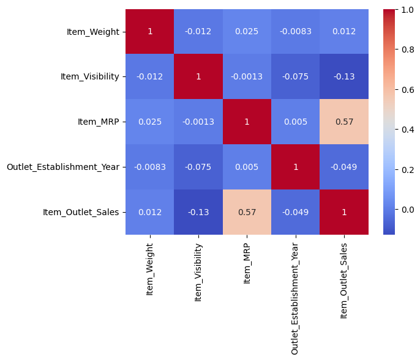

# **Grocery Sales Prediction**
## Build a predictive model and predict the sales of each product at a particular outlet

- **Author:** Jacob Tanzi 

### Retailer wants to understand the properties of products and outlets which play a key role in sales.:
## **Project Desciption**
### **Overview**
Using the Grocery Data we will, load and clean the data. Explore data analysis, explore visuals, pre process for machine learning, create machine learning pipelines, and test multiple machine learning models.

### **Data Source**
The data was sourced from [analyticsvidhya.com](https://datahack.analyticsvidhya.com/contest/practice-problem-big-mart-sales-iii/)

There are 8523 rows, and 12 columns.
The rows represent 8523 observations, and the columns represent 11 features and 1 target variable.

### **Data Dictionary**
- **Item_Identifier:** Unique product ID
- **Item_Weight:** Weight of product
- **Item_Fat_Content:** Whether the product is low fat or regular
- **Item_Visibility:** The percentage of total display area of all products in store allocated to the particular product
- **Item_Type:** The category to which the product belongs
- **Item_MRP:** Maximum Retail Price (list price) of the product
- **Outlet_Identifier:** Unique store ID
- **Outlet_Establishment_Year:** The year in which store was established
- **Outlet_Size:** The size of the store in terms of ground area covered
- **Outlet_Location_Type:** The type of area in which the store is located
- **Outlet_Type:** Whether the outlet is a grocery store or some sort of supermarket
- **Item_Outlet_Sales:** Sales of the product in the particular store. This is the target variable to be predicted.

## Methods
- Data was prepared by correcting null values, fixing inconsistencies, and dropping unnecessary columns  
-The data preperation allowed the exploratory analysis to focus on Item_Type, Item_Outlet_Sales, Outlet_Type

## Results

### Exploratory Data Analysis
-While exploring data a heatmap was made of any correlations of numeric data

#### Heatmap of correlations

>Heatmap used to visualize any correlations between, item weight, item visibility and item outlet sales.

#### Sales by Outlet Type
sales.by.outlet type.png

## Model

Describe your final model

Report the most important metrics

Refer to the metrics to describe how well the model would solve the business problem

## Recommendations:

More of your own text here

## Limitations & Next Steps

More of your own text here

### For further information

For any additional questions, please contact **email**
